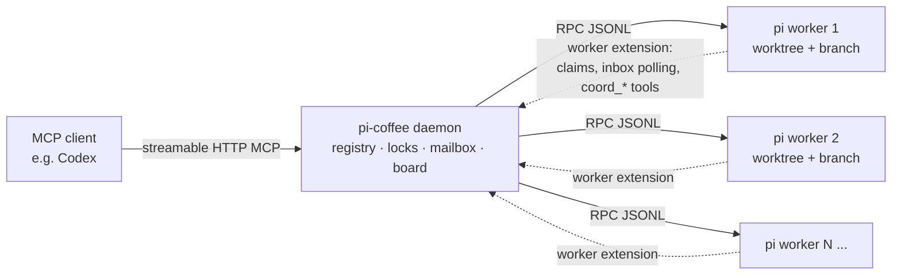

**[English](README.md) | [简体中文](README.zh-CN.md)**

# pi-coffee

pi-coffee is an MCP server that orchestrates several **pi** coding agents at once. Any MCP client
can drive it — Codex is the reference client, but Claude, Cursor, or anything else that speaks MCP
works too. The client stays the manager: it splits a job into well-defined pieces, hands each piece
to an agent, reviews what comes back, and merges. The agents do the typing.

Two agents editing the same repository normally overwrite each other. Here each agent works in its
own git worktree on its own branch, claims the files it is about to touch, and can message the other
agents or ask the orchestrator a question when something is unclear.

[](https://github.com/lucasjingcn/pi-coffee/actions/workflows/verify.yml)
[](https://nodejs.org)
[](LICENSE)
[](https://www.typescriptlang.org)
[](https://modelcontextprotocol.io)

## Contents

- [Background](#background)
- [What you get](#what-you-get)
- [A typical use case: cheap code, expensive judgment](#a-typical-use-case-cheap-code-expensive-judgment)
- [How it works](#how-it-works)
- [Requirements](#requirements)
- [Install and run](#install-and-run)
- [Pointing Codex at the daemon](#pointing-codex-at-the-daemon)
- [Docker](#docker)
- [A task, start to finish](#a-task-start-to-finish)
- [Deployment](#deployment)
- [Tool reference](#tool-reference)
- [Worker-side tools](#worker-side-tools)
- [How file claims work](#how-file-claims-work)
- [Cleaning up finished work](#cleaning-up-finished-work)
- [Configuration](#configuration)
- [State and recovery](#state-and-recovery)
- [Security](#security)
- [Troubleshooting](#troubleshooting)
- [Development](#development)
- [Upgrade and uninstall](#upgrade-and-uninstall)
- [Known limitations](#known-limitations)
- [License](#license)

## Background

A single coding agent is easy to supervise. Several of them on one checkout is not: they save over
each other's files, or produce long-lived branches that are painful to merge. The usual fixes
(copying the repo, serializing everything) either waste the parallelism or waste your time.

pi-coffee takes the opposite approach. Give every agent its own worktree, make file ownership explicit,
and keep one supervisor — Codex — responsible for the final result. That is the whole idea; the rest
of this document is the mechanics.

## What you get

- **One worktree and branch per worker.** Edits cannot collide because the checkouts are separate.
- **Advisory file claims.** A worker claims a path before writing to it. If another worker already
  holds a conflicting claim, the write is blocked with an explanation instead of silently racing.
- **A mailbox and a shared board.** Workers can send each other durable messages, and post facts or
  decisions that everyone can read.
- **Blocking questions.** A stuck worker can ask Codex a question through `coord_ask`. It shows up
  in `pi_wait` / `pi_status` and Codex answers with `pi_answer`.
- **Acceptance tests written by Codex.** Codex drops the test into the worktree and locks it before
  the worker starts, so the worker has to make the test pass rather than rewrite it.
- **Structured specs and a paper trail.** Every spawn carries a goal and a scope; the daemon rejects
  overlapping scopes up front. When the task is done, `pi_report` tells you how much of the work
  landed on the first try.

## A typical use case: cheap code, expensive judgment

Say you want to add a feature. You connect your MCP client (Codex, for example) to pi-coffee and let it
stay the manager. Codex plans the change, writes the spec and the acceptance test, and hands the
implementation to workers running on a cheap model — DeepSeek by default
(`PI_COFFEE_PROVIDER=deepseek`, `PI_COFFEE_MODEL=deepseek-flash`). The workers write the code in isolated
worktrees and run the tests; Codex reviews the diffs and verifies the result. The bulk of the
generated code never passes through the expensive model's output, and that is where the token
savings come from.

The loop looks like this:

1. Codex turns a requirement into a `spec` and an acceptance test.
2. `pi_spawn` starts one or more DeepSeek workers; they write the code and run the tests.
3. Codex reviews the diff and runs the acceptance command itself with `pi_exec`.
4. You merge. Most of the patch was written by the cheap model.

`pi_metrics` exposes `worker_output_per_orchestrator_token` for exactly this: a high ratio means the
expensive model stuck to judgment while the workers emitted the code. If you see Codex producing
large patches, you are paying premium prices for work a cheap model could have done.

A few honest caveats. Review and verification still cost money, and the result depends on how good
the spec is. The trade pays off when the task is bigger than a one-line fix; for tiny changes,
delegating costs more than doing it yourself, which is why `pi_spawn` warns about that case.

## How it works



The daemon (a small Node process) exposes an MCP endpoint over HTTP and an internal HTTP API. When
Codex calls `pi_spawn`, the daemon creates a worktree, starts `pi --mode rpc` as a child process, and
injects a worker-side extension into it. That extension is what enforces file claims, polls the
mailbox, and provides the `coord_*` tools inside the worker.

Workers talk to the daemon over JSONL lines on stdin/stdout; the daemon talks to Codex over MCP. The
daemon deliberately runs the `pi` executable rather than importing pi's internal modules, so a
`pi update` does not break the integration.

## Requirements

| | |
|---|---|
| **Node.js ≥ 22.19** | Runtime and test suite. CI covers 22.19 and 24. |
| **git** | Worktrees, diffs, merges, branch cleanup. |
| **pi** | `install.sh` can install it. It can authenticate from an API key in the environment, so the interactive `/login` step is optional. |
| **An MCP client** | Codex is the reference client; any MCP-capable client works. |

Run the daemon, Codex, and the workers as the **same Unix user**. They need to share file ownership.
Provider credentials can come from the generated env file (see below) or from pi's own
`~/.pi/agent/auth.json`. Root is not required — any user with a working `pi` and write access to the
repository is fine.

## Install and run

Grab the repository first if you have not already:

```bash
git clone https://github.com/lucasjingcn/pi-coffee.git
cd pi-coffee
```

Then:

```bash
./install.sh     # deps + build + Codex skill + MCP registration + pi/provider setup
./run.sh         # start the daemon in the foreground (http://127.0.0.1:8787)
```

`install.sh` does a few things:

- runs `npm install` and `npm run build`;
- installs the `pi-orchestrator` skill for Codex;
- registers the **stdio proxy** as the Codex MCP server (the proxy forwards to the HTTP daemon and
  reconnects on its own, so restarting the daemon does not break the Codex session);
- if `pi` is missing, offers to install it;
- asks for your provider, API key, and model, and stores them in `~/.pi-coffee/env` (mode 600).

Because pi reads provider API keys from the environment, that last step means you do **not** have to
run `/login` inside pi. Adjust it later with:

```bash
npm run setup     # provider, API key, model, thinking level (writes ~/.pi-coffee/env)
npm run doctor    # preflight: node, git, pi, credentials, data directory
```

`run.sh` sources `~/.pi-coffee/env` before starting the daemon, so spawned workers inherit the key.
Point it elsewhere with `PI_COFFEE_ENV_FILE`.

Check that it came up:

```bash
curl http://127.0.0.1:8787/internal/health   # {"ok":true,...}
```

Restart Codex. It connects, picks up the orchestration instructions, loads the `pi-orchestrator`
skill, and the `pi_*` tools appear. For a daemon that survives logout and reboots, install it as a
service — see [Deployment](#deployment).

## Pointing Codex at the daemon

`install.sh` handles this when `codex` is on your `PATH`. Otherwise, add the server yourself in
`~/.codex/config.toml` and restart Codex. Locally, use the stdio proxy:

```toml
[mcp_servers.pi]
command = "node"            # an absolute path to node is recommended
args = ["/absolute/path/to/pi-coffee/dist/stdio-proxy.js"]

[mcp_servers.pi.env]
PI_COFFEE_URL = "http://127.0.0.1:8787/mcp"
```

If the daemon runs on another machine, connect to it directly and pass a token:

```toml
[mcp_servers.pi]
url = "http://daemon-host:8787/mcp"

[mcp_servers.pi.env]
PI_COFFEE_TOKEN = "your-secret"
```

## Docker

The included `Dockerfile` bundles Node, git, and pi, so the only host requirement is Docker.

```bash
cp .env.example .env       # set your provider API key and model
mkdir -p workspace         # put or clone the repository workers should edit here
docker compose up -d --build
curl http://127.0.0.1:8787/internal/health
```

`./workspace` is mounted at `/workspace` and is the default repo; a named volume holds `/data`
(daemon state). The container reads the same `PI_COFFEE_*` variables and provider key from `.env`.

To connect Codex, point it at the container in `~/.codex/config.toml`:

```toml
[mcp_servers.pi]
url = "http://127.0.0.1:8787/mcp"

[mcp_servers.pi.env]
PI_COFFEE_TOKEN = "optional-shared-secret"
```

Set `PI_COFFEE_TOKEN` in `.env` too if you want authentication. The port is published on loopback by
default; expose it on `0.0.0.0` only together with a token.

Without Compose:

```bash
docker build -t pi-coffee .
docker run --rm -p 127.0.0.1:8787:8787 \
  -e PI_COFFEE_PROVIDER=deepseek -e PI_COFFEE_MODEL=deepseek-flash \
  -e DEEPSEEK_API_KEY=sk-... \
  -v "$PWD/workspace:/workspace" -v pi-coffee-data:/data \
  pi-coffee
```

Day-to-day operations:

```bash
docker compose logs -f                            # follow daemon logs
docker compose build --pull && docker compose up -d   # upgrade
docker compose down                               # stop (state volume is kept)
docker compose down -v                            # stop and drop daemon state
```

## A task, start to finish

This is roughly what a single delegated change looks like.

1. Codex derives an acceptance test from the requirement. It calls `pi_spawn` with a `spec`
   (`goal`, `scope`), the test in `acceptance_files`, and an `acceptance_command`. The test lands in
   the new worktree and is locked before the worker starts.
2. The worker reads the spec, edits files, and runs the test. If it needs a decision, it calls
   `coord_ask`; if it wants to touch a file another worker holds, `coord_send` is the way to
   negotiate.
3. Codex calls `pi_wait`, follows progress with `pi_tail`, and reads the full patch with `pi_diff`.
4. Before trusting the result, Codex runs the acceptance command itself with `pi_exec`.
5. Once it is happy, Codex merges (`pi_merge`), closes the workstream (`pi_finish`), prints the
   scoreboard (`pi_report`), and reclaims disk (`pi_gc`).

A worker gets two attempts: the original task plus one correction. A third instruction is refused
unless Codex explicitly overrides it and says why. If it still is not right, Codex takes over — that
is the intended outcome, not a failure.

## Deployment

### Linux (systemd)

```bash
sudo ./deploy/linux/install-service.sh    # system-wide service
./deploy/linux/install-service.sh         # or a per-user service in ~/.config/systemd/user/
loginctl enable-linger "$USER"            # required for a user service to start at boot
```

### macOS (launchd)

```bash
npm install && npm run build
./deploy/macos/install-daemon.sh          # writes ~/Library/LaunchAgents/com.pimcp.daemon.plist
```

Logs go to `~/.pi-coffee/logs/daemon.{out,err}.log`. Stop the agent with
`launchctl bootout gui/$(id -u)/com.pimcp.daemon`. The launch agent sets a `PATH` that includes
Homebrew and `~/.pi/agent/bin` so `pi` and `git` resolve.

To keep everything on one Mac (useful when the repository lives there):

```bash
rsync -a --exclude node_modules --exclude dist ./ mac:~/pi-coffee/
# then, on the Mac:
cd ~/pi-coffee && ./install.sh && ./run.sh
```

### Daemon on another machine

If the repository and the `pi` credentials live on one host and you only run Codex elsewhere, bind
the daemon to the LAN or VPN and set a shared token:

```bash
PI_COFFEE_HOST=0.0.0.0 PI_COFFEE_TOKEN=<secret> ./run.sh
```

On the Codex machine:

```bash
PI_COFFEE_TOKEN=<secret> codex mcp add pi \
  --url http://<daemon-host>:8787/mcp --bearer-token-env-var PI_COFFEE_TOKEN
```

`pi_diff`, `pi_commit`, `pi_merge`, and `pi_push` let Codex review and integrate code it cannot
reach directly. Do this only on a network you trust; the default bind is loopback.

## Tool reference

| Tool | What it does |
|---|---|
| `pi_spawn` | Create a worktree and branch, then start a worker. Takes a structured `spec` (`goal`, `scope` required; `non_goals`, `contracts`, `constraints`, `task_type` optional). The scope is claimed immediately, so an overlapping workstream is rejected before any code is written. `task_type=design\|security` is blocked unless you pass `spec_override`. `acceptance_files` and `acceptance_command` write and lock Codex-authored tests before the worker starts. |
| `pi_send` | Send an instruction: `mode=prompt\|steer\|followup`. A third instruction is blocked by the two-strikes rule unless `override:true`. Retries keep the same model. |
| `pi_wait` | Block until every listed session is `settled`, or until any worker asks a `question`. Keep timeouts at or under two minutes and poll again. |
| `pi_status` / `pi_list` | Current state: status, model, cost, context usage, pending questions. |
| `pi_tail` | Read the transcript incrementally by passing the previous `lastEntryId` as `since`. |
| `pi_diff` | Committed, uncommitted, and untracked changes for a worker branch. |
| `pi_commit` | Stage and commit everything in a worker's worktree. |
| `pi_merge` | Merge a worker branch into the main repo. On conflict the merge is left in progress and the conflicting files are returned. |
| `pi_push` | Push the current branch (or an explicit one) to a remote. |
| `pi_exec` | Run a shell command in a worker's worktree — this is how Codex verifies the acceptance test itself. |
| `pi_answer` | Answer a worker's pending question with `confirmed`, `value`, or `cancelled`. |
| `pi_claim` / `pi_release` / `pi_locks` | Claim paths by hand, release them, or list what is held. |
| `pi_message` / `pi_inbox` | Send durable mail to a worker (optionally injecting it into the conversation) and read it back. |
| `pi_board_post` / `pi_board_read` | Post to the shared board and read it, with a `latest=true` view per key. |
| `pi_stop` | Stop a worker, optionally removing its worktree and branch. |
| `pi_finish` | Record how a workstream ended: `success_first`, `success_second`, `taken_over`, or `abandoned`. |
| `pi_report` | The delegation scoreboard: first-try, second-try, and take-over counts with percentages. |
| `pi_gc` | Reclaim finished work. Removes clean finished worktrees and deletes only branches proven merged. |
| `pi_metrics` | Worker output tokens and cost versus how much Codex itself sent down the wire. |

## Worker-side tools

Each daemon-spawned pi session also gets these tools from the worker extension:

`coord_ask`, `coord_send`, `coord_inbox`, `coord_claim`, `coord_release`,
`coord_board_post`, `coord_board_read`, `coord_status`.

## How file claims work

Before a worker writes, it claims the path. On `edit` and `write` that is the target file. On `bash`
it scans the command for literal redirect, `tee`, and `sed -i` targets and claims those. If a claim
conflicts with another worker's, the tool call is blocked and the worker is told who holds it, so it
can coordinate instead of trampling the other change.

Claims are namespaced by the repository's canonical git common directory, combined with a
repo-relative path. Two checkouts of the same repository — including symlink aliases and linked
worktrees — share a namespace, while unrelated repositories never collide even if their file names
match. Absolute paths inside a worker's worktree are normalized to the same relative key before they
are hashed. `pi_claim` and `pi_release` can target a specific `repo`; if you leave it out, the daemon
default is used, while worker sessions always use their own repository.

The locks are advisory. They cover recognizable literal targets; variables, command substitution,
and globs are not resolved. For genuinely untrusted workers, use a read-only acceptance directory
and separate process isolation rather than relying on claims.

## Cleaning up finished work

`pi_gc` does two things. First it stops and evicts finished workers and removes their clean
worktrees. Then it deletes branches of finished workstreams that are proven merged.

A branch is only deleted when its tip is an ancestor of the repository's current `HEAD`. Work
integrated by squash or rebase is not an ancestor, so it is left alone for you to inspect — gc never
force-deletes. Candidates come from persisted metadata, so branches whose worktree is already gone
(for example, after a daemon restart) are still eligible. Branches are deduplicated per repo and
branch name.

Nothing is deleted while it is a current or default branch, checked out in any worktree, attached to
an active session, or attached to an existing dirty worktree. Abandoned and unfinished workstreams
are kept. These rules apply no matter how `PI_COFFEE_DELETE_BRANCHES` is set.

The result reports `branches_deleted` and a `branches_retained` entry with a reason for every branch
it kept. If git fails on a branch, it is retained and reported, never counted as deleted for you.

## Configuration

Everything is configured through environment variables.

| Variable | Default | Meaning |
|---|---|---|
| `PI_COFFEE_HOST` | `127.0.0.1` | Bind address. Loopback by default. |
| `PI_COFFEE_PORT` | `8787` | Port for `/mcp` and `/internal/*`. |
| `PI_COFFEE_PI_BIN` | `pi` | The pi executable. |
| `PI_COFFEE_DEFAULT_REPO` | *(none)* | Default repository for `pi_spawn`. If unset, every spawn must pass `repo`. |
| `PI_COFFEE_WORKSPACE_ROOT` | `~/.pi-coffee/worktrees` | Where worktrees are created. |
| `PI_COFFEE_PROVIDER` / `PI_COFFEE_MODEL` | `deepseek` / `deepseek-flash` | Worker provider and model. |
| `PI_COFFEE_STRONG_MODEL` | *(empty)* | Model for an explicit manual upgrade. Empty means no upgrade is available. |
| `PI_COFFEE_THINKING` | `xhigh` | pi thinking level: `off`, `minimal`, `low`, `medium`, `high`, `xhigh`, or `max`. Overridable per spawn. |
| `PI_COFFEE_MAX_SESSIONS` | `8` | Hard cap on concurrent workers. |
| `PI_COFFEE_PARALLEL_WARN` | `4` | Warn in `pi_spawn` once this many workers are active. |
| `PI_COFFEE_BASE_REF` | `HEAD` | Base ref for new worktrees. |
| `PI_COFFEE_AUTO_CLEAN` | `1` | Remove finished workers' worktrees automatically (branches are kept). |
| `PI_COFFEE_WORKTREE_TTL_MIN` | `60` | Minutes a finished, idle worker is kept before the sweeper cleans it. |
| `PI_COFFEE_DELETE_BRANCHES` | `0` | Default for the `delete_branch` flag on an explicit `pi_stop`. `pi_gc` ignores this. |
| `PI_COFFEE_TOKEN` | *(none)* | Optional shared secret for `/mcp` and `/internal/*`. |
| `PI_COFFEE_DATA_DIR` | `~/.pi-coffee` | Daemon state: locks, mailbox, board, session metadata. |
| `PI_COFFEE_ENV_FILE` | `~/.pi-coffee/env` | File that `run.sh`, `npm run setup`, and `npm run doctor` read/write for provider credentials. |

`install.sh` also honors `PI_COFFEE_SKIP_PI_INSTALL=1`, `PI_COFFEE_SKIP_SETUP=1`, and
`PI_COFFEE_YES=1` (answer yes to every prompt).

Bad values stop startup rather than limping along. Ports must be integers from 1 to 65535, session
caps and warning thresholds must be positive safe integers, and the TTL must be finite and at least
one minute (fractional minutes are fine). Numbers use decimal notation, and booleans accept only `0`
or `1`. Programmatic overrides passed to `loadConfig` win over both env vars and defaults.

## State and recovery

Daemon state lives in `state.json` inside `PI_COFFEE_DATA_DIR`. Writes are serialized and atomic: a
unique temp file is renamed into place, and the previous validated snapshot is kept as
`state.json.bak`.

On startup the whole snapshot is validated before any of it is applied. If the primary file is
missing or corrupt, a valid backup is used and a warning goes to stderr. If both are bad, or the
filesystem cannot be read, startup fails instead of quietly starting from scratch. Save failures are
logged; a failed flush during shutdown exits with a non-zero status.

The backup can lag the primary by one save, and there is no power-loss durability or multi-daemon
write locking. Run one daemon per state directory.

## Security

- The daemon binds to loopback and has no authentication by default. Setting `PI_COFFEE_TOKEN` enables
  it: the same secret must be presented on `/mcp` and `/internal/*`, either as
  `x-pi-coord-token` or `Authorization: Bearer <token>`.
- If you expose the daemon beyond loopback, use the token and a trusted network or VPN. A token on
  a shared network is not a substitute for network controls.
- File claims are a coordination mechanism, not a sandbox. Treat a worker as able to run arbitrary
  code in its worktree and plan accordingly.

## Troubleshooting

| Symptom | Likely cause | What to try |
|---|---|---|
| `{"error":"unauthorized"}` | Token mismatch between daemon and client | Set the same `PI_COFFEE_TOKEN` on the daemon and in the Codex/proxy environment. |
| `pi_spawn` fails with "repo is required" | No default repository configured | Set `PI_COFFEE_DEFAULT_REPO`, or pass `repo` on every spawn. |
| A worker starts and immediately errors out | `pi` is not logged in as the daemon user | Run `pi` once as that user to authenticate. |
| `git` complains about "dubious ownership" | The daemon user differs from the repo owner | The daemon already passes `safe.directory=*` to its own git calls; if you see this elsewhere, check your git version. |
| Sessions show `stopped` after a restart | Workers do not survive a daemon restart | This is expected. Spawn new sessions; the transcript files are still on disk. |
| The daemon exits with `EADDRINUSE` | The port is taken | Set `PI_COFFEE_PORT` to a free port. |
| `codex mcp add` is not found | `codex` is not on the daemon user's `PATH` | Register the server manually in `~/.codex/config.toml`. |
| A worker is blocked by a file claim | Another worker holds a conflicting claim | Use `coord_send` to coordinate, or `pi_release` if the claim is stale. |

## Development

```bash
npm ci                 # install (Node >= 22.19)
npm run build          # compile TypeScript to dist/
npm run setup          # write provider credentials to ~/.pi-coffee/env
npm run doctor         # check node/git/pi/credentials/data directory
npm run dev            # run the daemon from source with tsx
npm run typecheck      # main sources
npm run typecheck:extensions   # extension against the real pi API types
npm test               # build, then run the offline test suite
npm run verify         # typecheck + typecheck:extensions + test
./smoke.sh             # full end-to-end smoke (a couple of tiny live model calls)
SMOKE_LIVE=0 ./smoke.sh   # deterministic smoke only, no model calls
```

`npm test` compiles the sources and runs everything under `tests/`. The offline smoke test builds a
throwaway git repository and daemon and drives the whole control surface — spec validation, the
task-type gate, scope overlap, test-first acceptance, diffing, model overrides, the two-strikes
gate, finishing and reporting, and restart persistence — against a fake `pi` that speaks JSONL, so
it needs no credentials and no network.

GitHub Actions runs `npm ci` and `npm run verify` on pushes and pull requests, on Node 22.19.0 and
24. The pi dependency is pinned for development type checking only; CI does not log in to or call a
model provider.

### Repository layout

```
src/               daemon, MCP server, git plumbing, locks, state store
extensions/        worker-side pi extension (claims, inbox, coord_* tools)
tests/             offline test suite (node --test)
scripts/           setup, doctor, smoke, and status helpers
deploy/            systemd and launchd installers
codex/             Codex skill installed by install.sh
Dockerfile         image with Node, git, and pi bundled
docker-compose.yml host-facing compose file
.env.example       provider key / model template for Docker
```

## Upgrade and uninstall

Native install:

```bash
git pull
npm install
npm run build
# restart the daemon: systemctl --user restart pi-coffee, or stop and re-run ./run.sh
```

Docker:

```bash
docker compose build --pull && docker compose up -d
```

To remove everything:

```bash
# stop the daemon first (the service, `docker compose down`, or Ctrl-C on ./run.sh)
rm -rf ~/.pi-coffee ~/.pi-mcp                    # daemon state and credentials
rm -rf "${CODEX_HOME:-$HOME/.codex}/skills/pi-orchestrator"
codex mcp remove pi
```

### Upgrading from pi-mcp

The project was previously called `pi-mcp`, using `PI_MCP_*` variables and `~/.pi-mcp` for state. If
you have an older install, either move the state or point at it:

```bash
mv ~/.pi-mcp ~/.pi-coffee                         # or: export PI_COFFEE_DATA_DIR=~/.pi-mcp
```

In your env file, rename every `PI_MCP_*` variable to `PI_COFFEE_*` (for example `PI_MCP_TOKEN` to
`PI_COFFEE_TOKEN`).

## Known limitations

- Workers do not survive a daemon restart. Shutting the daemon down stops them, and they are not
  brought back automatically. Their session files are kept, but you spawn new sessions.
- File claims are advisory and only cover literal, recognizable targets.
- The git worktree model assumes one worker per branch. Forcing the same branch into two worktrees
  is not supported.

## License

Apache License 2.0. See [LICENSE](LICENSE).

Copyright 2026 lucasjing.

pi (`@earendil-works/pi-coding-agent`) is a separate MIT-licensed program by Mario Zechner. This
repository invokes it as an external tool rather than redistributing its code; the Docker image
installs it from npm at build time. pi is not affiliated with, and does not endorse, this project.
