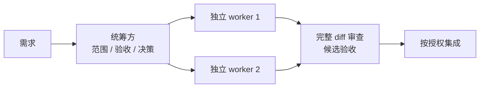
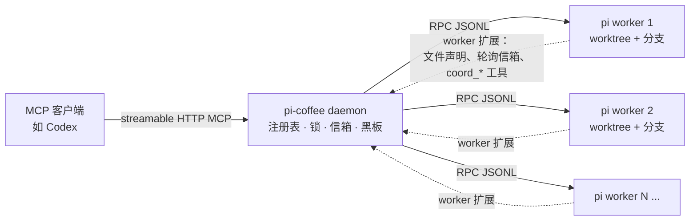

**[English](README.md) | [简体中文](README.zh-CN.md)**

# pi-coffee

**让编码代理协作有范围、有验收证据。** pi-coffee 是一个 MCP 服务：统筹方把独立实现交给隔离
git worktree 中的 pi worker，审查完整 diff，并在合并前验证候选结果。小修改直接完成。

任何支持 MCP 的客户端都能驱动它。Codex 是参考客户端，Claude、Cursor 等同样可用。客户端把任务拆成
边界清楚的几块，交给不同的代理，审查它们交回来的东西，最后合并。真正敲代码的是那些代理。

同一个仓库上挂两个代理，默认结果就是互相覆盖。这里换了个做法：每个代理在自己的 git worktree、
自己的分支上干活；动手写某个文件之前先声明；需要沟通时给别的代理发消息，或者直接向统筹方提问。

> **应该衡量什么**
>
> - 独立工作预期收益大于规格、审查与集成开销时才派发。
> - 保持既定模型能力与成品质量，价格更低也必须满足质量标准。
> - 成本对比计入失败、返工和主代理审查。
> - `pi_metrics` 报告使用量与费用覆盖范围，部分 token 比值不能证明省钱。

[](#成本与派发证据)
[](https://github.com/lucasjingcn/pi-coffee/actions/workflows/verify.yml)
[](https://nodejs.org)
[](LICENSE)
[](https://www.typescriptlang.org)
[](https://modelcontextprotocol.io)

## 目录

- [背景](#背景)
- [它能给你什么](#它能给你什么)
- [成本与派发证据](#成本与派发证据)
- [工作原理](#工作原理)
- [环境要求](#环境要求)
- [安装与启动](#安装与启动)
- [让 Codex 连上 daemon](#让-codex-连上-daemon)
- [Docker](#docker)
- [一个任务的全过程](#一个任务的全过程)
- [部署](#部署)
- [工具参考](#工具参考)
- [Worker 端工具](#worker-端工具)
- [文件声明是怎么工作的](#文件声明是怎么工作的)
- [清理已完成的工作](#清理已完成的工作)
- [配置](#配置)
- [状态与恢复](#状态与恢复)
- [安全](#安全)
- [常见问题](#常见问题)
- [开发](#开发)
- [升级与卸载](#升级与卸载)
- [已知限制](#已知限制)
- [许可证](#许可证)

## 背景

一个编码代理其实很好管。难的是一份代码上同时跑好几个：它们会互相覆盖对方的改动，或者留下一堆
又长又难合的分支。通常的应对要么是复制整个仓库，要么把活儿全部串起来，前者把并行度浪费掉，后者
把你的时间浪费掉。

pi-coffee 反过来做：给每个代理一个独立 worktree，把“谁在写哪个文件”这件事讲明白，并且始终只留
Codex 一个负责人对结果负责。思路就这么点，下面都是具体机制。

## 它能给你什么

- **每个 worker 一个 worktree 和分支。** 检出目录彼此独立，改动自然撞不到一起。
- **建议性的文件锁。** worker 写文件前先声明路径；如果和别人的声明冲突，这次写入会被拦下并说明
  原因，而不是默默地抢。
- **信箱和共享黑板。** worker 之间可以发持久化消息，也可以把结论、约定贴到所有人都能读的黑板上。
- **会阻塞的提问。** 卡住的 worker 可以用 `coord_ask` 向 Codex 提问，问题会出现在 `pi_wait` /
  `pi_status` 里，由 Codex 用 `pi_answer` 回答。
- **由 Codex 写的验收测试。** 测试在 worker 启动前就放进 worktree 并加锁，worker 只能想办法让
  测试通过；集成前还会检查内容摘要，文件锁本身不是沙箱。
- **先验证候选再合并。** `pi_verify` 在 worker 与目标提交形成的候选上跑固定验收；提交变化、
  测试失败或超范围改动都阻止合并。
- **结构化 spec 和可追溯记录。** 每次 spawn 都带 goal 和 scope，范围重叠会在派发阶段就被拒绝。
  任务结束时用 `pi_report` 就能看到有多少活儿是一次就过的。

## 成本与派发证据

默认 worker 配置是 DeepSeek（`PI_COFFEE_PROVIDER=deepseek`、`PI_COFFEE_MODEL=deepseek-flash`）。
使用前确认它满足任务既定质量标准；模型切换服从用户批准和项目规则。小修复、强耦合修改直接做。
只有范围明确、独立、能客观验收且预期收益大于协调开销的工作才考虑派发。



`pi_metrics` 统计活跃与历史任务，失败和返工也计入。缺失费用显示未知；用 `session_ids` 选择任务集合，
用 `pi_record_cost` 登记主代理费用的金额、币种、来源（`manual`、`estimate` 或 `provider`）、
非空证据引用与覆盖的 session ID。
`pi_report` 在任务结局之外返回 `cost_evidence`；手动、估算和提供方报告的费用分别标注。

`spec.purpose` 标明 `implementation`（实现）、`review`（评审）或 `investigation`（调查）；
`pi_report.workstreams_by_purpose` 分开统计数量与结局。历史未分类任务显示 `unspecified`，不猜测。
总体百分比包含所有用途，不能表示代码贡献比例；报告时还须说明 worker 实际改动和主会话直接完成的工作。
开发前委派评估与接管规则统一维护在[编排规则](codex/pi-orchestrator/SKILL.md)。

worker 输出量除以部分指令 token 只是输出分工指标，不能当节省率或质量评分。完整总费用需要 worker
与主代理费用齐全、覆盖同一任务集合且币种兼容。证明省钱还需相同范围、验收、质量的对照基线，计入
等待、审查、失败和返工。离线测试不证明真实模型质量或费用收益。

## 工作原理



daemon 是一个不大的 Node 进程，对外提供 HTTP 上的 MCP 接口，同时有一套内部 HTTP API。Codex 调
`pi_spawn` 时，daemon 会建好 worktree，把 `pi --mode rpc` 作为子进程启动，并给它注入一个 worker
端扩展。文件声明、信箱轮询和 `coord_*` 工具都由这个扩展提供。

worker 通过 stdin/stdout 上的 JSONL 和 daemon 通信，daemon 再通过 MCP 和 Codex 通信。daemon
刻意去跑 `pi` 可执行文件，而不是 import pi 的内部模块，这样 `pi update` 不会把集成搞坏。

## 环境要求

| | |
|---|---|
| **Node.js ≥ 22.19** | 运行时和测试都需要。CI 覆盖 22.19 和 24。 |
| **git** | worktree、diff、merge、分支清理都靠它。 |
| **pi** | 由 npm 安装固定版本；可从环境变量读 API key，交互式 `/login` 可选。 |
| **MCP 客户端** | Codex 是参考实现，任何支持 MCP 的客户端都可用。 |
| **Windows 10+** | 安装 Git for Windows（含 Git Bash），Node 和 Codex CLI 在 `PATH` 中。 |

**请让 daemon、Codex 和 worker 用同一个用户跑。** 它们要共享文件属主。provider 凭据可以来自
下面生成的 env 文件，也可以来自 pi 自己的 `~/.pi/agent/auth.json`。不需要 root，只要这个用户能正常
用 `pi`、并且对仓库有写权限就行。

## 安装与启动

还没拿到代码的话先克隆：

```bash
git clone https://github.com/lucasjingcn/pi-coffee.git
cd pi-coffee
```

然后：

```bash
npm run install:local
```

这条命令在 macOS/Linux 终端或 Windows 10+ PowerShell 中都可用。它会：

- 跑 `npm install` 和 `npm run build`；
- 给 Codex 安装 `pi-orchestrator` skill；
- 把 **stdio 代理**注册成 Codex 的 MCP server（代理转发到 HTTP daemon 并自动重连，所以重启 daemon
  不会弄断 Codex 会话）；
- 从 npm 安装固定版本的 pi；
- 问你要 provider、API key 和 model，写进当前用户的 `.pi-coffee/env`；
- 安装并启动当前用户的登录后台任务（macOS LaunchAgent、Linux systemd 用户服务或 Windows 计划任务）。

因为 pi 直接从环境变量读 provider 密钥，最后这一步意味着**不需要**再进 pi 跑 `/login`。之后想改：

```bash
npm run setup     # 交互式设置 provider、API key、model、thinking 级别（写入 ~/.pi-coffee/env）
npm run doctor    # 预检：node、git、pi、凭据、数据目录
```

前台调试时先停止后台 daemon，再运行 `npm run start`。两种启动方式都会通过 `scripts/start.mjs` 读取同一份配置；可用 `PI_COFFEE_ENV_FILE` 改位置。

起来之后确认一下：

```bash
curl http://127.0.0.1:8787/internal/health   # {"ok":true,...}
```

然后重启 Codex。它会连上来、拿到编排说明、加载 `pi-orchestrator` skill，`pi_*` 工具随即出现。
Windows 后台任务在当前用户登录后启动；未登录时不会运行。

## 让 Codex 连上 daemon

`codex` 在 `PATH` 里的话，`npm run install:local` 已经帮你配好了。手工修复时可写进 `~/.codex/config.toml`，
再重启 Codex。本机用 stdio 代理：

```toml
[mcp_servers.pi]
command = "node"            # 建议写成 node 的绝对路径
args = ["/absolute/path/to/pi-coffee/scripts/proxy.mjs"]

[mcp_servers.pi.env]
PI_COFFEE_URL = "http://127.0.0.1:8787/mcp"
```

daemon 在别的机器上，就直接连，并带上 token：

```toml
[mcp_servers.pi]
url = "http://daemon-host:8787/mcp"

[mcp_servers.pi.env]
PI_COFFEE_TOKEN = "your-secret"
```

## Docker

仓库里的 `Dockerfile` 已经把 Node、git 和 pi 都打进去了，宿主机只需要有 Docker。

```bash
cp .env.example .env       # 填好 provider 的 API key 和 model
mkdir -p workspace         # 把要让 worker 改的仓库放进来或克隆到这里
docker compose up -d --build
curl http://127.0.0.1:8787/internal/health
```

`./workspace` 挂载到 `/workspace`，是默认仓库；`/data` 用命名卷保存 daemon 状态。容器从 `.env`
读取同样的 `PI_COFFEE_*` 变量和 provider 密钥。

让 Codex 连容器，写进 `~/.codex/config.toml`：

```toml
[mcp_servers.pi]
url = "http://127.0.0.1:8787/mcp"

[mcp_servers.pi.env]
PI_COFFEE_TOKEN = "optional-shared-secret"
```

要鉴权的话，`.env` 里也设上 `PI_COFFEE_TOKEN`。端口默认只发布到回环；要暴露到 `0.0.0.0` 请务必
同时设置 token。

不用 Compose 也可以：

```bash
docker build -t pi-coffee .
docker run --rm -p 127.0.0.1:8787:8787 \
  -e PI_COFFEE_PROVIDER=deepseek -e PI_COFFEE_MODEL=deepseek-flash \
  -e DEEPSEEK_API_KEY=sk-... \
  -v "$PWD/workspace:/workspace" -v pi-coffee-data:/data \
  pi-coffee
```

日常运维：

```bash
docker compose logs -f                                # 跟日志
docker compose build --pull && docker compose up -d   # 升级
docker compose down                                   # 停止（保留状态卷）
docker compose down -v                                # 停止并清掉 daemon 状态
```

## 一个任务的全过程

先遵守用户指令和目标仓库 `AGENTS.md`。预期收益明确才派发，一行修复直接完成。ai-gen 的体量闸门
还要求至少三项独立任务才考虑并行子代理；其他仓库遵守各自规则。

1. 从需求推导验收。`pi_spawn` 带 `spec`（`goal`、`scope`、`purpose`）和派发时固定的 `acceptance_command`。
   需要独立测试时通过 `acceptance_files` 写入；worker 启动前会锁定并记录内容摘要。
2. worker 按范围修改、运行测试；决策问题走 `coord_ask`，冲突先协调。报告文件、命令、结果和未决问题。
3. 等 worker 停止工作后读完整 `pi_diff`，按项目与用户授权提交已审查改动；验证要求 worker 分支干净。
4. 调用 `pi_verify`，从明确的 worker 与目标提交形成隔离候选，运行固定验收。检查退出码、超时、输出、
   提交 SHA 和候选树证据。
5. `pi_merge` 要求当前候选的有效通过证据。提交变化、验收文件篡改、超范围改动、脏目标工作树、失败
   或超时都阻止集成；候选变化后重新验收。daemon 重启不会恢复历史合并许可。
6. 用 `pi_finish` 关闭工作流，查看 `pi_report` / `pi_metrics`。成功结局须有通过的验收；代码改动还须
   有集成记录。按授权用 `pi_gc` 回收资源。

`pi_exec` 用于诊断和 worker 检查，通过不代表获得合并许可。最终审查与判断由统筹方负责。
worker 有初始任务加一次纠正，第 3 条指令需说明 override 理由。模型切换遵循用户批准。
提交、推送、部署和收费调用分别按用户与项目授权；缺凭据只阻塞实际模型调用，可独立的本地工作继续。

## 部署

上面的单条安装命令会按系统配置后台运行。维护命令如下。

### Linux（systemd 用户服务）

```bash
systemctl --user status pi-coffee
systemctl --user stop pi-coffee
```

### macOS（launchd）

```bash
launchctl print gui/$(id -u)/com.picoffee.daemon
```

日志在 `~/.pi-coffee/logs/daemon.{out,err}.log`。停止命令：
`launchctl bootout gui/$(id -u)/com.picoffee.daemon`。这个 launch agent 会把 Homebrew 和
`~/.pi/agent/bin` 加进 `PATH`，保证 `pi` 和 `git` 能被找到。

### Windows 10+（当前用户登录计划任务）

PowerShell 用 `Get-ScheduledTask -TaskName pi-coffee` 查看，用 `Stop-ScheduledTask -TaskName pi-coffee` 停止。
日志位于 `%USERPROFILE%\.pi-coffee\logs\daemon.log`。worker 验收命令需要 Git for Windows 提供 Git Bash。

如果仓库就在 Mac 上，整套都放本机最省事：

```bash
rsync -a --exclude node_modules --exclude dist ./ mac:~/pi-coffee/
# 然后在 Mac 上：
cd ~/pi-coffee && npm run install:local
```

### daemon 放在另一台机器

仓库和 `pi` 凭据都在一台机器上、只在别处跑 Codex 时可以用这种拓扑。把 daemon 绑到局域网或 VPN，
并设置一个共享 token：

```bash
PI_COFFEE_HOST=0.0.0.0 PI_COFFEE_TOKEN=<secret> ./run.sh
```

在 Codex 那台机器上：

```bash
PI_COFFEE_TOKEN=<secret> codex mcp add pi \
  --url http://<daemon-host>:8787/mcp --bearer-token-env-var PI_COFFEE_TOKEN
```

`pi_diff`、`pi_commit`、`pi_merge`、`pi_push` 让 Codex 在拿不到文件系统的情况下也能审查和集成代码。
只在你信得过的网络里这么做，默认绑定是回环。

## 工具参考

| 工具 | 作用 |
|---|---|
| `pi_spawn` | 建 worktree 和分支，启动 worker。接收结构化 `spec`（`goal`、`scope` 必填，`purpose`、`non_goals`、`contracts`、`constraints`、`task_type` 可选）。`purpose=implementation\|review\|investigation` 区分用途，未填写显示未分类。scope 会立刻声明，范围重叠的工作流在写代码之前就被拒绝。`task_type=design\|security` 会被拦下，除非传 `spec_override`。`acceptance_files` 和 `acceptance_command` 会在 worker 启动前写入并锁定 Codex 写的测试。 |
| `pi_send` | 下指令：`mode=prompt\|steer\|followup`。第 3 条指令会被 two-strikes 规则拦下，除非传 `override:true`。重试不会换模型。 |
| `pi_wait` | 阻塞到所有会话 `settled`，或任一 worker 提出 `question`。超时控制在两分钟以内，然后重新轮询。 |
| `pi_status` / `pi_list` | 当前状态：状态、模型、成本、上下文占用、待处理问题。 |
| `pi_tail` | 增量读会话记录，把上次的 `lastEntryId` 作为 `since` 传进去。 |
| `pi_diff` | 某个 worker 分支的已提交、未提交和未跟踪改动。 |
| `pi_commit` | 把 worker worktree 里的改动全部提交。 |
| `pi_verify` | 对明确的 worker 与目标候选运行固定验收，保存退出码、超时、输出和提交/候选树证据；失败、过时或重启前的证据不授权集成。 |
| `pi_merge` | 仅在当前候选验收通过、范围与摘要有效、worker 已停止工作且双方工作树干净时合并；来源或目标变化须重验。 |
| `pi_push` | 把当前分支（或指定分支）推到远端。 |
| `pi_exec` | 在 worker worktree 用非登录 shell 运行诊断命令；不会产生合并验收证据。 |
| `pi_answer` | 回答 worker 的待处理问题，用 `confirmed`、`value` 或 `cancelled`。 |
| `pi_claim` / `pi_release` / `pi_locks` | 手动声明、释放路径，或查看当前都有哪些声明。 |
| `pi_message` / `pi_inbox` | 给 worker 发持久化消息（可选择注入到对话里），以及读取消息。 |
| `pi_board_post` / `pi_board_read` | 往共享黑板写、从共享黑板读，`latest=true` 可以只看每个 key 的最新一条。 |
| `pi_stop` | 停止 worker，可选择一并移除 worktree 和分支。 |
| `pi_finish` | 记录 `success_first`、`success_second`、`taken_over` 或 `abandoned`；接管须在 `note` 填写非空原因；成功与接管须有当前通过证据，代码改动还须已集成。 |
| `pi_report` | 按任务用途分组的结局数量、逐任务接管原因，以及包含所有用途的总体百分比；不能当代码贡献比例。 |
| `pi_gc` | 回收已完成工作。移除干净的已完成 worktree，只删除已证明合并的分支。 |
| `pi_metrics` | 活跃与历史任务的使用量和费用证据，可用 `session_ids` 过滤；缺失费用为未知，部分比值不证明省钱。 |
| `pi_record_cost` | 登记主代理费用：`id`、`amount`、`currency`、`source`、`reference`、覆盖的 `session_ids`；区分实报、手动和估算来源。 |

## Worker 端工具

每个由 daemon 启动的 pi 会话还会拿到一组 worker 扩展提供的工具：

`coord_ask`、`coord_send`、`coord_inbox`、`coord_claim`、`coord_release`、
`coord_board_post`、`coord_board_read`、`coord_status`。

## 文件声明是怎么工作的

协调器不可达、响应无效或必要锁申请被拒绝时，扩展会阻止 `edit`、`write`、`bash`；解决后可重新连接并
重试。可识别的工作树外写入（含解析后的符号链接目标）会被拒绝。worker 写文件前先声明。`edit` 和 `write` 声明目标文件；`bash` 会去命令里找字面量的重定向、`tee`
和 `sed -i` 目标，一并声明。如果声明和别人冲突，这次工具调用直接失败并告诉 worker 是谁占着，让它
去协调，而不是硬写。

声明的命名空间由仓库的规范化 git common 目录加上仓库相对路径组成。同一仓库的不同检出——包括符号
链接别名和 linked worktree——共享一个命名空间；不相干的仓库即使文件名一样也不会撞。worker worktree
里的绝对路径会先归一成相对键再计算。`pi_claim` 和 `pi_release` 可以指定 `repo`；不指定就用 daemon
默认仓库，而 worker 会话永远用自己的仓库。

这些锁提供协作保护，不是安全沙箱。动态脚本、变量、命令替换和 glob 的任意写入不受完整隔离；
摘要和范围检查能阻止错误成果集成，但不能撤销任意脚本的写入。不可信 worker 需要独立设计的 OS/容器
隔离、凭据限制和只读验收挂载；本版本不提供该强隔离。

## 清理已完成的工作

`pi_gc` 做两件事。先把已完成的 worker 停掉、驱逐，并移除它们干净的 worktree；然后删除那些已经
证明合并的已完成工作流分支。

只有分支尖端是仓库当前 `HEAD` 的祖先时才会删。用 squash 或 rebase 集成进来的提交不是祖先，会被
留着让你自己看，gc 从不强删。候选来自持久化元数据，所以 worktree 已经没了的分支（比如 daemon
重启过）同样会被处理。分支按仓库加分支名去重。

只要分支还是当前或默认分支、被任何 worktree 检出、挂在活跃会话上，或者挂在一个已存在的脏 worktree
上，就不会删。被放弃和未完成的工作流一律保留。这些规则跟 `PI_COFFEE_DELETE_BRANCHES` 怎么设无关。

结果里会给出 `branches_deleted`，以及每个被保留分支的 `branches_retained` 和原因。git 操作失败的
分支会被保留并如实上报，绝不会被算进删除数里。

## 配置

全部通过环境变量配置。

| 变量 | 默认值 | 含义 |
|---|---|---|
| `PI_COFFEE_HOST` | `127.0.0.1` | 绑定地址，默认只监听回环。 |
| `PI_COFFEE_PORT` | `8787` | `/mcp` 和 `/internal/*` 的端口。 |
| `PI_COFFEE_PI_BIN` | `pi` | pi 可执行文件。 |
| `PI_COFFEE_DEFAULT_REPO` | *(空)* | `pi_spawn` 的默认仓库。不设的话每次 spawn 都要传 `repo`。 |
| `PI_COFFEE_WORKSPACE_ROOT` | `~/.pi-coffee/worktrees` | worktree 的创建位置。 |
| `PI_COFFEE_PROVIDER` / `PI_COFFEE_MODEL` | `deepseek` / `deepseek-flash` | worker 的 provider 和 model。 |
| `PI_COFFEE_STRONG_MODEL` | *(空)* | 用于显式手动升级的模型。留空就没有升级可用。 |
| `PI_COFFEE_THINKING` | `xhigh` | worker 的 pi thinking 级别：`off`、`minimal`、`low`、`medium`、`high`、`xhigh`、`max`。可在单次 spawn 覆盖。 |
| `PI_COFFEE_MAX_SESSIONS` | `8` | 并发 worker 硬上限。 |
| `PI_COFFEE_PARALLEL_WARN` | `4` | 活跃 worker 达到这个数时，`pi_spawn` 会给出提醒。 |
| `PI_COFFEE_BASE_REF` | `HEAD` | 新 worktree 的基点。 |
| `PI_COFFEE_AUTO_CLEAN` | `1` | 自动移除已完成 worker 的 worktree（保留分支）。 |
| `PI_COFFEE_WORKTREE_TTL_MIN` | `60` | 已完成且空闲的 worker 在被清理前保留多少分钟。 |
| `PI_COFFEE_DELETE_BRANCHES` | `0` | 显式 `pi_stop` 的 `delete_branch` 默认值。`pi_gc` 不看这个。 |
| `PI_COFFEE_TOKEN` | *(空)* | `/mcp` 和 `/internal/*` 的可选共享密钥。 |
| `PI_COFFEE_DATA_DIR` | `~/.pi-coffee` | daemon 状态：锁、信箱、黑板、会话元数据。 |
| `PI_COFFEE_ENV_FILE` | `~/.pi-coffee/env` | `npm run start`、Codex 代理、setup 和 doctor 共用的配置及凭据文件。 |

无人值守安装时设置 `PI_COFFEE_SKIP_SETUP=1`，并通过环境变量或已有 env 文件提供凭据；预检通过后才会安装后台启动。

配置不合法时启动会直接失败，而不是带着问题跑。端口必须是 1 到 65535 的整数，会话上限和提醒阈值必须
是正的安全整数，TTL 必须有限且至少一分钟（可以有小数）。数字用十进制；布尔只接受 `0` 或 `1`。
传给 `loadConfig` 的代码级 override 优先级最高。

## 状态与恢复

daemon 状态存在 `PI_COFFEE_DATA_DIR` 下的 `state.json`。写入是串行且原子的：先写唯一临时文件再 rename，
上一份通过校验的快照留在 `state.json.bak`。

启动时会先完整校验快照，通过之后才应用。主文件缺失或损坏就用有效备份，并在 stderr 打一条警告；
两个都坏，或者文件系统读不了，启动直接失败，不会悄悄从零开始。写盘失败会记日志；关闭时刷盘失败
会以非零状态退出。

验收结果保留为历史证据，但 daemon 重启使原合并许可失效；集成前重新验证当前候选。费用记录继续属于
历史任务证据。

备份可能比主文件少一次写入；没有断电持久性保证，也不支持多个 daemon 同时写。一个状态目录只跑一个
daemon。

## 安全

- daemon 默认只绑回环，也没有鉴权。设置 `PI_COFFEE_TOKEN` 就会开启：`/mcp` 和 `/internal/*` 都要带
  同一个密钥，放在 `x-pi-coord-token` 或 `Authorization: Bearer <token>` 里。
- 要把 daemon 暴露到回环之外，就同时用 token 和可信网络/VPN。共享网络里光有 token 不能替代网络
  层的控制。
- 文件声明是协调机制，不是沙箱。请把 worker 当成能在自己 worktree 里跑任意代码来对待。

## 常见问题

| 现象 | 多半是 | 怎么办 |
|---|---|---|
| 返回 `{"error":"unauthorized"}` | daemon 和客户端 token 对不上 | 让 daemon 和 Codex/代理环境用同一个 `PI_COFFEE_TOKEN`。 |
| `pi_spawn` 报 "repo is required" | 没配默认仓库 | 设 `PI_COFFEE_DEFAULT_REPO`，或者每次 spawn 都传 `repo`。 |
| worker 一起来就报错退出 | `pi` 没以 daemon 用户登录 | 用那个用户跑一次 `pi` 完成登录。 |
| git 抱怨 "dubious ownership" | daemon 用户和仓库属主不一致 | daemon 给自己的 git 调用已经加了 `safe.directory=*`；如果在别处看到，检查 git 版本。 |
| 重启后会话变成 `stopped` | worker 不会跨 daemon 重启存活 | 这是预期行为，重新 spawn；会话记录文件还在。 |
| daemon 启动时报 `EADDRINUSE` | 端口被占用 | 把 `PI_COFFEE_PORT` 换成一个空闲端口。 |
| 找不到 `codex mcp add` | `codex` 不在 daemon 用户的 `PATH` 里 | 手动写 `~/.codex/config.toml`。 |
| worker 被文件声明挡住 | 另一个 worker 占着冲突的声明 | 用 `coord_send` 协调，声明确实过期就用 `pi_release`。 |

## 开发

```bash
npm ci                 # 安装依赖（Node >= 22.19）
npm run build          # 把 TypeScript 编译到 dist/
npm run setup          # 写 provider 凭据到 ~/.pi-coffee/env
npm run doctor         # 检查 node/git/pi/凭据/数据目录
npm run dev            # 用 tsx 直接从源码跑 daemon
npm run typecheck      # 主代码类型检查
npm run typecheck:extensions   # 用真实 pi API 类型检查扩展
npm test               # 构建后跑离线测试套件
npm run verify         # typecheck + typecheck:extensions + 离线测试
node scripts/sync-playbook.mjs --check  # 构建后检查权威 skill、运行时和安装来源一致
./smoke.sh             # 完整端到端冒烟（含少量真实模型调用）
SMOKE_LIVE=0 ./smoke.sh   # 只跑确定性冒烟，不调用模型
```

`npm test` 会先编译源码，再跑 `tests/` 下的全部用例。离线冒烟测试会临时建一个 git 仓库和 daemon，
用一个只会说 JSONL 的假 `pi` 把整条控制链走一遍：spec 校验、task-type 关卡、scope 重叠、验收测试
先行、diff、模型覆盖、two-strikes、finish/report、重启持久化。它不需要任何凭据，也不需要网络。

GitHub Actions 配置在 push 和 pull request 时，用 Linux/macOS 与 Node 22.19.0/24 跑
`npm ci` 和 `npm run verify`；远端结果以实际运行记录为准，workflow 文件存在不代表 macOS CI 通过。
pi 依赖固定版本只是为了开发期类型检查，CI 不登录、也不调用任何模型提供方。

编排正文只维护在 `codex/pi-orchestrator/SKILL.md`；运行时直接加载正文，安装程序复制同一个文件。
部署时保留 `codex/`、`src/` 和 `dist/`。升级后把新版 skill 复制到
`${CODEX_HOME:-$HOME/.codex}/skills/pi-orchestrator/SKILL.md`，重启 daemon 和 MCP 客户端，保持策略版本一致。

### 仓库结构

```
src/               daemon、MCP server、git 操作、锁、状态存储
extensions/        worker 端 pi 扩展（文件声明、信箱、coord_* 工具）
tests/             离线测试套件（node --test）
scripts/           setup、doctor、冒烟和状态辅助脚本
deploy/            systemd 和 launchd 安装脚本
codex/             npm run install:local 安装的 Codex skill
Dockerfile         内置 Node、git、pi 的镜像
docker-compose.yml 面向用户的 compose 文件
.env.example       Docker 用的 provider 密钥 / model 模板
```

## 升级与卸载

本地安装：

```bash
git pull
npm install
npm run build
# 重启 daemon：systemctl --user restart pi-coffee，或停掉后重新 ./run.sh
```

Docker：

```bash
docker compose build --pull && docker compose up -d
```

彻底卸载：

```bash
# 先停掉 daemon（服务、`docker compose down`，或对 ./run.sh 按 Ctrl-C）
rm -rf ~/.pi-coffee                              # daemon 状态与凭据
rm -rf "${CODEX_HOME:-$HOME/.codex}/skills/pi-orchestrator"
codex mcp remove pi
```

## 已知限制

- worker 不会跨 daemon 重启存活。关闭 daemon 就会把它们停掉，重启后不会自动拉起。会话文件会留着，
  但需要你重新 spawn。
- 文件声明是建议性的，而且只覆盖能识别出来的字面量目标。
- worktree 模型假设一个分支只对应一个 worker。把同一个分支强行塞进两个 worktree 不在支持范围内。

## 许可证

Apache License 2.0，见 [LICENSE](LICENSE)。

版权所有 2026 lucasjing。

pi（`@earendil-works/pi-coding-agent`）是 Mario Zechner 的独立 MIT 项目。本仓库只是把它当作外部
程序调用，不再分发其代码；Docker 镜像在构建时从 npm 安装它。pi 与本项目没有隶属关系，也不为本项目
背书。
