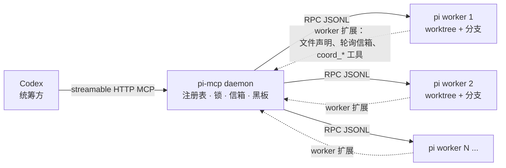

**[English](README.md) | [简体中文](README.zh-CN.md)**

# pi-coffee

pi-coffee 是 **pi-mcp** 这个项目的仓库。pi-mcp 是一个 MCP 服务，让 Codex 能同时带好几个 **pi**
编码代理。（npm 包名、`bin` 名和 MCP server 名都叫 `pi-mcp`，只有这个仓库叫 `pi-coffee`。）
Codex 仍然负责统筹：把任务拆成边界清楚的几块，交给不同的代理，审查它们交回来的东西，最后合并。
真正敲代码的是那些代理。

同一个仓库上挂两个代理，默认结果就是互相覆盖。这里换了个做法：每个代理在自己的 git worktree、
自己的分支上干活；动手写某个文件之前先声明；需要沟通时给别的代理发消息，或者直接向 Codex 提问。

[](https://github.com/lucasjingcn/pi-coffee/actions/workflows/verify.yml)
[](https://nodejs.org)
[](LICENSE)
[](https://www.typescriptlang.org)
[](https://modelcontextprotocol.io)

## 目录

- [背景](#背景)
- [它能给你什么](#它能给你什么)
- [工作原理](#工作原理)
- [环境要求](#环境要求)
- [安装与启动](#安装与启动)
- [让 Codex 连上 daemon](#让-codex-连上-daemon)
- [一个任务的全过程](#一个任务的全过程)
- [部署](#部署)
- [工具参考](#工具参考)
- [Worker 端工具](#worker-端工具)
- [文件声明是怎么工作的](#文件声明是怎么工作的)
- [清理已完成的工作](#清理已完成的工作)
- [配置](#配置)
- [状态与恢复](#状态与恢复)
- [安全](#安全)
- [常见问题](#常见问题)
- [开发](#开发)
- [已知限制](#已知限制)
- [许可证](#许可证)

## 背景

一个编码代理其实很好管。难的是一份代码上同时跑好几个：它们会互相覆盖对方的改动，或者留下一堆
又长又难合的分支。通常的应对要么是复制整个仓库，要么把活儿全部串起来，前者把并行度浪费掉，后者
把你的时间浪费掉。

pi-mcp 反过来做：给每个代理一个独立 worktree，把“谁在写哪个文件”这件事讲明白，并且始终只留
Codex 一个负责人对结果负责。思路就这么点，下面都是具体机制。

## 它能给你什么

- **每个 worker 一个 worktree 和分支。** 检出目录彼此独立，改动自然撞不到一起。
- **建议性的文件锁。** worker 写文件前先声明路径；如果和别人的声明冲突，这次写入会被拦下并说明
  原因，而不是默默地抢。
- **信箱和共享黑板。** worker 之间可以发持久化消息，也可以把结论、约定贴到所有人都能读的黑板上。
- **会阻塞的提问。** 卡住的 worker 可以用 `coord_ask` 向 Codex 提问，问题会出现在 `pi_wait` /
  `pi_status` 里，由 Codex 用 `pi_answer` 回答。
- **由 Codex 写的验收测试。** 测试在 worker 启动前就放进 worktree 并加锁，worker 只能想办法让
  测试通过，没法改写测试。
- **结构化 spec 和可追溯记录。** 每次 spawn 都带 goal 和 scope，范围重叠会在派发阶段就被拒绝。
  任务结束时用 `pi_report` 就能看到有多少活儿是一次就过的。

## 工作原理



daemon 是一个不大的 Node 进程，对外提供 HTTP 上的 MCP 接口，同时有一套内部 HTTP API。Codex 调
`pi_spawn` 时，daemon 会建好 worktree，把 `pi --mode rpc` 作为子进程启动，并给它注入一个 worker
端扩展。文件声明、信箱轮询和 `coord_*` 工具都由这个扩展提供。

worker 通过 stdin/stdout 上的 JSONL 和 daemon 通信，daemon 再通过 MCP 和 Codex 通信。daemon
刻意去跑 `pi` 可执行文件，而不是 import pi 的内部模块，这样 `pi update` 不会把集成搞坏。

## 环境要求

| | |
|---|---|
| **Node.js ≥ 22.19** | 运行时和测试都需要。CI 覆盖 22.19 和 24。 |
| **git** | worktree、diff、merge、分支清理都靠它。 |
| **pi** | 已安装，且以 daemon 用户身份登录。 |
| **Codex** | 任意支持 MCP 的版本即可。 |

**请让 daemon、Codex 和 worker 用同一个 Unix 用户跑。** 它们要共享文件属主和同一个
`~/.pi/agent/auth.json`。不需要 root，只要这个用户能正常用 `pi`、并且对仓库有写权限就行。

## 安装与启动

还没拿到代码的话先克隆：

```bash
git clone https://github.com/lucasjingcn/pi-coffee.git
cd pi-coffee
```

然后：

```bash
./install.sh     # npm install + 构建 + 安装 Codex skill + 注册 MCP server
./run.sh         # 前台启动 daemon（http://127.0.0.1:8787）
```

`install.sh` 会把 **stdio 代理**注册成 Codex 的 MCP server。代理负责转发到 HTTP daemon 并自动重连，
所以重启 daemon 不会把 Codex 会话弄断。

起来之后确认一下：

```bash
curl http://127.0.0.1:8787/internal/health   # {"ok":true,...}
```

然后重启 Codex。它会连上来、拿到编排说明、加载 `pi-orchestrator` skill，`pi_*` 工具随即出现。
如果希望 daemon 在退出登录、重启之后还在，就装成服务，见[部署](#部署)。

## 让 Codex 连上 daemon

`codex` 在 `PATH` 里的话，`install.sh` 已经帮你配好了。否则自己写进 `~/.codex/config.toml`，
再重启 Codex。本机用 stdio 代理：

```toml
[mcp_servers.pi]
command = "node"            # 建议写成 node 的绝对路径
args = ["/absolute/path/to/pi-mcp/dist/stdio-proxy.js"]

[mcp_servers.pi.env]
PI_MCP_URL = "http://127.0.0.1:8787/mcp"
```

daemon 在别的机器上，就直接连，并带上 token：

```toml
[mcp_servers.pi]
url = "http://daemon-host:8787/mcp"

[mcp_servers.pi.env]
PI_MCP_TOKEN = "your-secret"
```

## 一个任务的全过程

一次典型的委派大概是这样：

1. Codex 从需求出发写一份验收测试，调用 `pi_spawn` 时带上 `spec`（`goal`、`scope`）、
   `acceptance_files` 里的测试，以及 `acceptance_command`。测试会落进新 worktree，并在 worker
   启动前加锁。
2. worker 读 spec、改文件、跑测试。拿不定主意就 `coord_ask`；想动别人已经声明的文件，就先
   `coord_send` 去谈。
3. Codex 用 `pi_wait` 等结果，用 `pi_tail` 跟进，用 `pi_diff` 读完整补丁。
4. 在采信之前，Codex 自己用 `pi_exec` 跑一遍验收命令。
5. 满意之后合并（`pi_merge`）、关闭工作流（`pi_finish`）、打印记分板（`pi_report`），最后
   回收磁盘（`pi_gc`）。

一个 worker 有两次机会：初始任务加一次纠正。第 3 条指令会被拒绝，除非 Codex 明确 override 并
说明理由。如果还是不行，Codex 自己接手——这是预期结果，不算流程失败。

## 部署

### Linux（systemd）

```bash
sudo ./deploy/linux/install-service.sh    # 系统级服务
./deploy/linux/install-service.sh         # 或者装到 ~/.config/systemd/user/ 的用户级服务
loginctl enable-linger "$USER"            # 用户级服务要开机自启必须执行
```

### macOS（launchd）

```bash
npm install && npm run build
./deploy/macos/install-daemon.sh          # 写入 ~/Library/LaunchAgents/com.pimcp.daemon.plist
```

日志在 `~/.pi-mcp/logs/daemon.{out,err}.log`。停止命令：
`launchctl bootout gui/$(id -u)/com.pimcp.daemon`。这个 launch agent 会把 Homebrew 和
`~/.pi/agent/bin` 加进 `PATH`，保证 `pi` 和 `git` 能被找到。

如果仓库就在 Mac 上，整套都放本机最省事：

```bash
rsync -a --exclude node_modules --exclude dist ./ mac:~/pi-mcp/
# 然后在 Mac 上：
cd ~/pi-mcp && ./install.sh && ./run.sh
```

### daemon 放在另一台机器

仓库和 `pi` 凭据都在一台机器上、只在别处跑 Codex 时可以用这种拓扑。把 daemon 绑到局域网或 VPN，
并设置一个共享 token：

```bash
PI_MCP_HOST=0.0.0.0 PI_MCP_TOKEN=<secret> ./run.sh
```

在 Codex 那台机器上：

```bash
PI_MCP_TOKEN=<secret> codex mcp add pi \
  --url http://<daemon-host>:8787/mcp --bearer-token-env-var PI_MCP_TOKEN
```

`pi_diff`、`pi_commit`、`pi_merge`、`pi_push` 让 Codex 在拿不到文件系统的情况下也能审查和集成代码。
只在你信得过的网络里这么做，默认绑定是回环。

## 工具参考

| 工具 | 作用 |
|---|---|
| `pi_spawn` | 建 worktree 和分支，启动 worker。接收结构化 `spec`（`goal`、`scope` 必填，`non_goals`、`contracts`、`constraints`、`task_type` 可选）。scope 会立刻声明，范围重叠的工作流在写代码之前就被拒绝。`task_type=design\|security` 会被拦下，除非传 `spec_override`。`acceptance_files` 和 `acceptance_command` 会在 worker 启动前写入并锁定 Codex 写的测试。 |
| `pi_send` | 下指令：`mode=prompt\|steer\|followup`。第 3 条指令会被 two-strikes 规则拦下，除非传 `override:true`。重试不会换模型。 |
| `pi_wait` | 阻塞到所有会话 `settled`，或任一 worker 提出 `question`。超时控制在两分钟以内，然后重新轮询。 |
| `pi_status` / `pi_list` | 当前状态：状态、模型、成本、上下文占用、待处理问题。 |
| `pi_tail` | 增量读会话记录，把上次的 `lastEntryId` 作为 `since` 传进去。 |
| `pi_diff` | 某个 worker 分支的已提交、未提交和未跟踪改动。 |
| `pi_commit` | 把 worker worktree 里的改动全部提交。 |
| `pi_merge` | 把 worker 分支合进主仓库。有冲突时保留合并中间状态，并返回冲突文件。 |
| `pi_push` | 把当前分支（或指定分支）推到远端。 |
| `pi_exec` | 在 worker 的 worktree 里跑命令，Codex 就是靠它自己验证验收测试的。 |
| `pi_answer` | 回答 worker 的待处理问题，用 `confirmed`、`value` 或 `cancelled`。 |
| `pi_claim` / `pi_release` / `pi_locks` | 手动声明、释放路径，或查看当前都有哪些声明。 |
| `pi_message` / `pi_inbox` | 给 worker 发持久化消息（可选择注入到对话里），以及读取消息。 |
| `pi_board_post` / `pi_board_read` | 往共享黑板写、从共享黑板读，`latest=true` 可以只看每个 key 的最新一条。 |
| `pi_stop` | 停止 worker，可选择一并移除 worktree 和分支。 |
| `pi_finish` | 记录工作流的结局：`success_first`、`success_second`、`taken_over` 或 `abandoned`。 |
| `pi_report` | 委派记分板：一次过、二次过、被接管的数量和占比。 |
| `pi_gc` | 回收已完成工作。移除干净的已完成 worktree，只删除已证明合并的分支。 |
| `pi_metrics` | worker 的输出 token 和成本，对比 Codex 自己发出去的指令量。 |

## Worker 端工具

每个由 daemon 启动的 pi 会话还会拿到一组 worker 扩展提供的工具：

`coord_ask`、`coord_send`、`coord_inbox`、`coord_claim`、`coord_release`、
`coord_board_post`、`coord_board_read`、`coord_status`。

## 文件声明是怎么工作的

worker 写文件前先声明。`edit` 和 `write` 声明目标文件；`bash` 会去命令里找字面量的重定向、`tee`
和 `sed -i` 目标，一并声明。如果声明和别人冲突，这次工具调用直接失败并告诉 worker 是谁占着，让它
去协调，而不是硬写。

声明的命名空间由仓库的规范化 git common 目录加上仓库相对路径组成。同一仓库的不同检出——包括符号
链接别名和 linked worktree——共享一个命名空间；不相干的仓库即使文件名一样也不会撞。worker worktree
里的绝对路径会先归一成相对键再计算。`pi_claim` 和 `pi_release` 可以指定 `repo`；不指定就用 daemon
默认仓库，而 worker 会话永远用自己的仓库。

这些锁是建议性的，只覆盖能识别出来的字面量目标，变量、命令替换和 glob 都不解析。真要隔离不可信的
worker，应该用只读验收目录加进程隔离，而不是指望文件声明。

## 清理已完成的工作

`pi_gc` 做两件事。先把已完成的 worker 停掉、驱逐，并移除它们干净的 worktree；然后删除那些已经
证明合并的已完成工作流分支。

只有分支尖端是仓库当前 `HEAD` 的祖先时才会删。用 squash 或 rebase 集成进来的提交不是祖先，会被
留着让你自己看，gc 从不强删。候选来自持久化元数据，所以 worktree 已经没了的分支（比如 daemon
重启过）同样会被处理。分支按仓库加分支名去重。

只要分支还是当前或默认分支、被任何 worktree 检出、挂在活跃会话上，或者挂在一个已存在的脏 worktree
上，就不会删。被放弃和未完成的工作流一律保留。这些规则跟 `PI_MCP_DELETE_BRANCHES` 怎么设无关。

结果里会给出 `branches_deleted`，以及每个被保留分支的 `branches_retained` 和原因。git 操作失败的
分支会被保留并如实上报，绝不会被算进删除数里。

## 配置

全部通过环境变量配置。

| 变量 | 默认值 | 含义 |
|---|---|---|
| `PI_MCP_HOST` | `127.0.0.1` | 绑定地址，默认只监听回环。 |
| `PI_MCP_PORT` | `8787` | `/mcp` 和 `/internal/*` 的端口。 |
| `PI_MCP_PI_BIN` | `pi` | pi 可执行文件。 |
| `PI_MCP_DEFAULT_REPO` | *(空)* | `pi_spawn` 的默认仓库。不设的话每次 spawn 都要传 `repo`。 |
| `PI_MCP_WORKSPACE_ROOT` | `~/.pi-mcp/worktrees` | worktree 的创建位置。 |
| `PI_MCP_PROVIDER` / `PI_MCP_MODEL` | `deepseek` / `deepseek-flash` | worker 的 provider 和 model。 |
| `PI_MCP_STRONG_MODEL` | *(空)* | 用于显式手动升级的模型。留空就没有升级可用。 |
| `PI_MCP_THINKING` | `xhigh` | worker 的 pi thinking 级别：`off`、`minimal`、`low`、`medium`、`high`、`xhigh`、`max`。可在单次 spawn 覆盖。 |
| `PI_MCP_MAX_SESSIONS` | `8` | 并发 worker 硬上限。 |
| `PI_MCP_PARALLEL_WARN` | `4` | 活跃 worker 达到这个数时，`pi_spawn` 会给出提醒。 |
| `PI_MCP_BASE_REF` | `HEAD` | 新 worktree 的基点。 |
| `PI_MCP_AUTO_CLEAN` | `1` | 自动移除已完成 worker 的 worktree（保留分支）。 |
| `PI_MCP_WORKTREE_TTL_MIN` | `60` | 已完成且空闲的 worker 在被清理前保留多少分钟。 |
| `PI_MCP_DELETE_BRANCHES` | `0` | 显式 `pi_stop` 的 `delete_branch` 默认值。`pi_gc` 不看这个。 |
| `PI_MCP_TOKEN` | *(空)* | `/mcp` 和 `/internal/*` 的可选共享密钥。 |
| `PI_MCP_DATA_DIR` | `~/.pi-mcp` | daemon 状态：锁、信箱、黑板、会话元数据。 |

配置不合法时启动会直接失败，而不是带着问题跑。端口必须是 1 到 65535 的整数，会话上限和提醒阈值必须
是正的安全整数，TTL 必须有限且至少一分钟（可以有小数）。数字用十进制；布尔只接受 `0` 或 `1`。
传给 `loadConfig` 的代码级 override 优先级最高。

## 状态与恢复

daemon 状态存在 `PI_MCP_DATA_DIR` 下的 `state.json`。写入是串行且原子的：先写唯一临时文件再 rename，
上一份通过校验的快照留在 `state.json.bak`。

启动时会先完整校验快照，通过之后才应用。主文件缺失或损坏就用有效备份，并在 stderr 打一条警告；
两个都坏，或者文件系统读不了，启动直接失败，不会悄悄从零开始。写盘失败会记日志；关闭时刷盘失败
会以非零状态退出。

备份可能比主文件少一次写入；没有断电持久性保证，也不支持多个 daemon 同时写。一个状态目录只跑一个
daemon。

## 安全

- daemon 默认只绑回环，也没有鉴权。设置 `PI_MCP_TOKEN` 就会开启：`/mcp` 和 `/internal/*` 都要带
  同一个密钥，放在 `x-pi-coord-token` 或 `Authorization: Bearer <token>` 里。
- 要把 daemon 暴露到回环之外，就同时用 token 和可信网络/VPN。共享网络里光有 token 不能替代网络
  层的控制。
- 文件声明是协调机制，不是沙箱。请把 worker 当成能在自己 worktree 里跑任意代码来对待。

## 常见问题

| 现象 | 多半是 | 怎么办 |
|---|---|---|
| 返回 `{"error":"unauthorized"}` | daemon 和客户端 token 对不上 | 让 daemon 和 Codex/代理环境用同一个 `PI_MCP_TOKEN`。 |
| `pi_spawn` 报 "repo is required" | 没配默认仓库 | 设 `PI_MCP_DEFAULT_REPO`，或者每次 spawn 都传 `repo`。 |
| worker 一起来就报错退出 | `pi` 没以 daemon 用户登录 | 用那个用户跑一次 `pi` 完成登录。 |
| git 抱怨 "dubious ownership" | daemon 用户和仓库属主不一致 | daemon 给自己的 git 调用已经加了 `safe.directory=*`；如果在别处看到，检查 git 版本。 |
| 重启后会话变成 `stopped` | worker 不会跨 daemon 重启存活 | 这是预期行为，重新 spawn；会话记录文件还在。 |
| daemon 启动时报 `EADDRINUSE` | 端口被占用 | 把 `PI_MCP_PORT` 换成一个空闲端口。 |
| 找不到 `codex mcp add` | `codex` 不在 daemon 用户的 `PATH` 里 | 手动写 `~/.codex/config.toml`。 |
| worker 被文件声明挡住 | 另一个 worker 占着冲突的声明 | 用 `coord_send` 协调，声明确实过期就用 `pi_release`。 |

## 开发

```bash
npm ci                 # 安装依赖（Node >= 22.19）
npm run build          # 把 TypeScript 编译到 dist/
npm run dev            # 用 tsx 直接从源码跑 daemon
npm run typecheck      # 主代码类型检查
npm run typecheck:extensions   # 用真实 pi API 类型检查扩展
npm test               # 构建后跑离线测试套件
npm run verify         # typecheck + typecheck:extensions + test
./smoke.sh             # 完整端到端冒烟（含少量真实模型调用）
SMOKE_LIVE=0 ./smoke.sh   # 只跑确定性冒烟，不调用模型
```

`npm test` 会先编译源码，再跑 `tests/` 下的全部用例。离线冒烟测试会临时建一个 git 仓库和 daemon，
用一个只会说 JSONL 的假 `pi` 把整条控制链走一遍：spec 校验、task-type 关卡、scope 重叠、验收测试
先行、diff、模型覆盖、two-strikes、finish/report、重启持久化。它不需要任何凭据，也不需要网络。

GitHub Actions 在 push 和 pull request 时用 Node 22.19.0 和 24 跑 `npm ci` 和 `npm run verify`。
pi 依赖固定版本只是为了开发期类型检查，CI 不登录、也不调用任何模型提供方。

### 仓库结构

```
src/          daemon、MCP server、git 操作、锁、状态存储
extensions/   worker 端 pi 扩展（文件声明、信箱、coord_* 工具）
tests/        离线测试套件（node --test）
scripts/      冒烟和状态辅助脚本
deploy/       systemd 和 launchd 安装脚本
codex/        install.sh 安装的 Codex skill
```

## 已知限制

- worker 不会跨 daemon 重启存活。关闭 daemon 就会把它们停掉，重启后不会自动拉起。会话文件会留着，
  但需要你重新 spawn。
- 文件声明是建议性的，而且只覆盖能识别出来的字面量目标。
- worktree 模型假设一个分支只对应一个 worker。把同一个分支强行塞进两个 worktree 不在支持范围内。

## 许可证

Apache License 2.0，见 [LICENSE](LICENSE)。

版权所有 2026 lucasjing。
